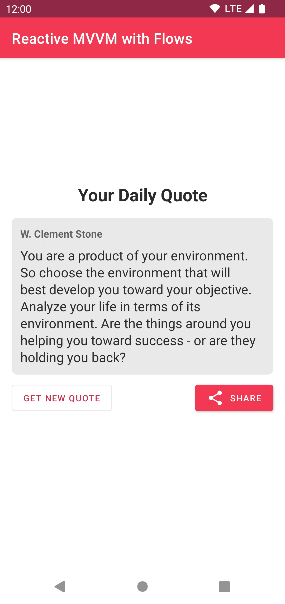

# Reactive MVVM with Flows 📱

A showcase app to demonstrate how a **reactive MVVM** approach using **Flows** could look in Android.

## Android development

This MVVM implementation orchestrates the whole app functionality through the next Flows:

* State = [StateFlow](https://developer.android.com/kotlin/flow/stateflow-and-sharedflow#stateflow)
* Actions = [SharedFlow](https://developer.android.com/kotlin/flow/stateflow-and-sharedflow#sharedflow)
* Events = [Channel](https://kotlinlang.org/docs/channels.html)

The app follows a unidirectional data flow paradigm like MVI but leaves out complexities such as reducers or processors.

## The app - Your Daily Quote 💬

The app is a simple **random Quote generator** with the ability to share the generated Quote.

## Third party data

The quotes used throughout the app have been picked from the open source project [Quotable](https://github.com/lukePeavey/quotable).

